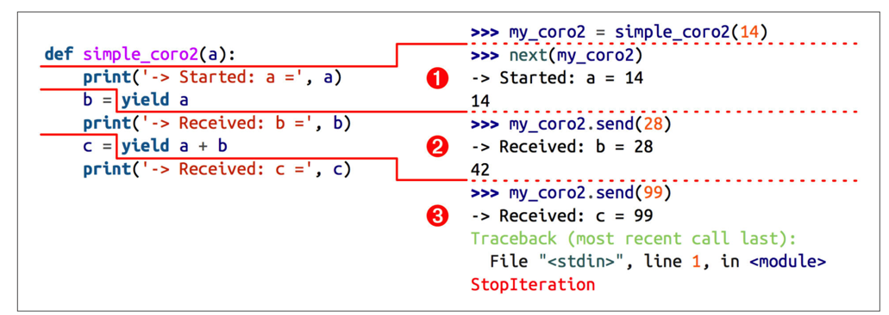

**All of contents from the book Fluent Python, this is some note**

- The *behavior* and *states* of a generator operating as a coroutine.
- [Priming a coroutine automatically with a decorator](prime_coroutine_decorator.py).
- How the caller can control a coroutine through the `.close()` and `.throw()` methods of the generator object
- How coroutines can return values upon termination.
- Usage and semantics of the new `yield from` syntax.
- A use case: coroutines for managing concurrent activities in simulation.
---
## How coroutines evolved from generators
`yield/send` --> `@asyncio.coroutine`(Python3.4+) and `yield from`(Python3.3+) --> `async/await`(Python3.5+)
## Basic behavior of `generator` used as `coroutine`

```python
>>> def simple_coroutine():
...     print('-> coroutine started')
...     x = yield
...     print('-> coroutine received:', x)
>>> my_coro = simple_coroutine()
>>> my_coro
<generator object simple_coroutine at 0x10e8d0bf8>
>>> next(my_coro)
-> coroutine started
>>> my_coro.send(42)
-> coroutine received: 42
Traceback (most recent call last):
    ...
StopIteration
``` 

> A `coroutine` can be in one of four states. `inspect.getgeneratorstate(...)` -> one of the strings:

> `GEN_CREATED`: Waiting to start execution.

> `GEN_RUNNING`: Currently being executed by the interpreter.(You’ll only see this state in a multi-threaded application — or if the generator object calls getgenerator state on itself, which is not useful.)

> `GEN_SUSPENDED`: Currently suspended at a yield expression.

> `GEN_CLOSED`: Execution has completed.


```python
>>> def simple_coro2(a):
...     print('-> Started: a =', a)
...     b = yield a
...     print('-> Received: b =', b)
...     c = yield a + b
...     print('-> Received: c =', c)
...
>>> my_coro2 = simple_coro2(14)
>>> from inspect import getgeneratorstate
>>> getgeneratorstate(my_coro2)
'GEN_CREATED'
>>> next(my_coro2)
-> Started: a = 14
14
>>> getgeneratorstate(my_coro2)
'GEN_SUSPENDED'
>>> my_coro2.send(28)
-> Recevied: b = 28
42
>>> my_coro2.send(99)
-> Received: c = 99
Traceback (most recent call last):
    File "<stdin>", line 1, in <module>
StopIteration
>>> getgeneratorstate(my_coro2)
'GEN_CLOSED'
```


```python
def averager():
    total = 0
    count = 0
    average = None
    while True:
        term = yield average
        total += term
        count += 1
        average = total / count
        
>>> coro_avg = averager()
>>> next(coro_avg)
>>> coro_avg.send(10)
10.0
>>> coro_avg.sned(30)
20.0
>>> coro_avg.send(5)
15.0

"""
The call `next(coro_avg)` makes the coroutine advance to the `yield`, yielding the initial value for average which is None so it does not appear on the console.

At this point, the coroutine is suspended at the `yield`, waiting for a value to be sent.

The line `coro_avg.send(10)` provides that value, causing the coroutine to activate, assigning it to term, updating the total, count and average variables and then starting another iteration in the while loop, which yields the average and waits for another term.
"""
```

## Coroutine termination and exception handling
> One way of terminating coroutine: use `send` with some sentinel value that tells the coroutine to exit.
> Constant built-in singleton `None` and `Ellipsis` are convenient sentinel value.
> `StopIteration` is another sentinel value, `my_coroutine.send(StopIteration)`.

> Generator objects have two methods that allows the client to explicitly send exceptions into the coroutine
> `generator.throw(exc_type[, exc_value[, traceback]])`, `generator.close()`

## Using `yield from`
> `yield from` can be used as a shortcut to yield in a for loop.

```python
>>> def gen():
...     for c in 'ABC':
...         yield c
...     for i in range(1, 3):
...         yield i
...
>>> list(gen())
['A', 'B', 'C', 1, 2]
# equal to
>>> def gen():
...     yield from 'ABC'
...     yield from range(1, 3)
...
>>> list(gen())
['A', 'B', 'C', 1, 2]

# Didactic example only. The `itertools` module already provides an optimized chain function written in C.
>>> def chain(*iterables):
...     for it in iterables:
...         yield from it
...
>>> s = 'ABC'
>>> t = tuple(range(3))
>>> list(chain(s, t))
['A', 'B', 'C', 0, 1, 2]
```
> **The main feature of `yield from` is to _open a bidirectional channel_ from the outermost caller to the innermost subgenerator, so that values can be sent and yielded back and forth directly from them, and exceptions can be thrown all the way in without adding a lot of exception handling boilerplate code in the intermediate coroutines. This is what enables coroutine delegation in a way that was not possible before.**

- `delegating generator`: The generator function that contains the `yield from <iterable>` expression.
- `subgenerator`: The generator obtained from the `<iterable>` part of the `yield from` expression.
- `caller`(`client`): The client code that calls the delegating generator.
> While the delegating generator is suspended at yield from, the caller sends data directly to the subgenerator, which yields data back to the caller. The delegating generator resumes when the subgenerator returns and the interpreter raises `StopIteration` with the returned value attached

> [`yield from` coroutine example](coroutine_averager.py)

## How `yield from` work explain
> Explain of this single statement, in the body of the delegating generator: **`RESULT = yield from EXPR`**

```python
RESULT = yield from EXPR
# pseudocode equivalent to the statement RESULT = yield from EXPR in the delegating generator

_i = iter(EXPR)
try:
    _y = next(_i)
except StopIteration as _e:
    _r = _e.value
else:
    while 1:
        _s = yield _y
        try:
            _y = _i.send(_s)
        except StopIteration as _e:
            _r = _e.value
            break
RESULT = _r
```
- `_i(iterator)`: The subgenerator
- `_y(yielded)`: A value yielded from the subgnerator.
- `_r(result)`: The eventual result, i.e. the value of the `yield from` expression when the subgen‐ erator ends.
- `_s(sent)`: A value sent by the caller to the delegating generator, which is forwarded to the subgenerator.
- `_e(exception)`: An exception (always an instance of `StopIteration` in this simplified pseudocode).
---

## Further reading
[Coroutine Wikipedia](https://zh.wikipedia.org/wiki/%E5%8D%8F%E7%A8%8B)

[Subroutine VS Coroutine](https://en.wikipedia.org/wiki/Coroutine#Comparison_with_subroutines)

[A Curious Course on Coroutines and Concurrency by David Beazley](http://www.dabeaz.com/coroutines/)

[Tasks and coroutines](https://docs.python.org/3/library/asyncio-task.html)

[Evolutionary history of Python coroutine](http://blog.guoyb.com/2016/07/03/python-coroutine/)
